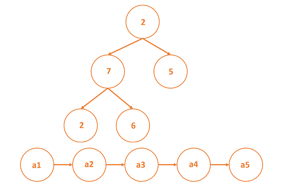
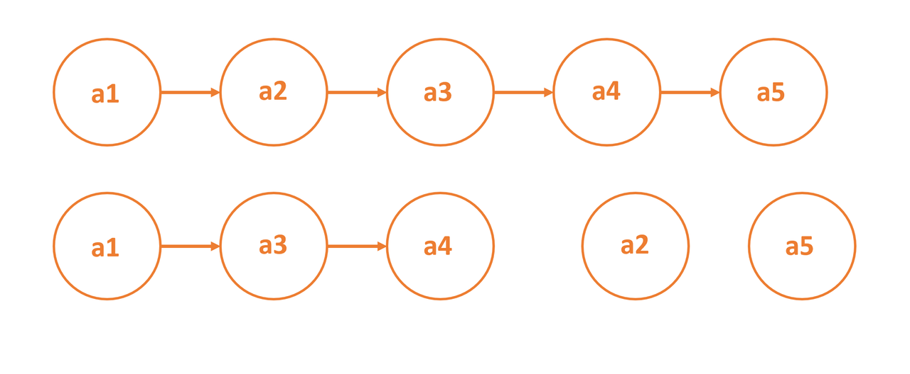

# Node: An individual part of a larger data structure

Nodes are a basic data structure which contain data and one or more links to other nodes.

Nodes can be used to represent a tree structure or a linked list.

In such structures where nodes are used, it is possible to traverse from one node to another node.

## Orphaned nodes

Nodes that have no links pointing to them except for the head node, are considered “orphaned.”

In the illustration, if the nodes a2 and a5 are removed, they will be orphaned.

## Null Node Link

Data structures containing nodes have typically two bits of information stored in a node: data and link to next node.

The first part is a value and the second part is an address of sorts pointing to the next node.

In this way, a system of nodes is created.

A NULL value in the link part of a node’s info denotes that the path or data structure contains no further nodes.
