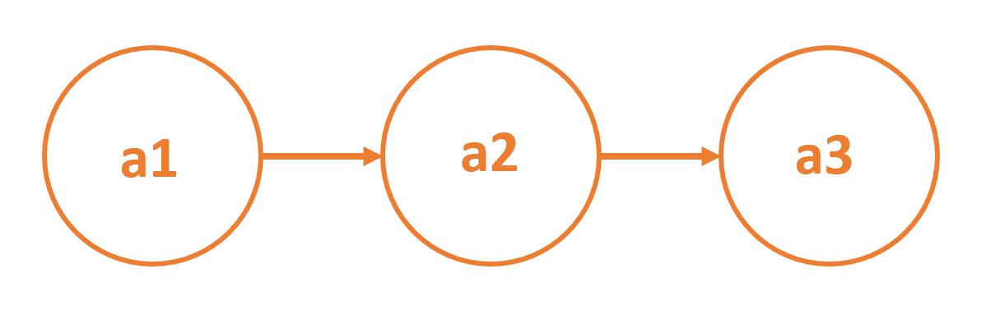
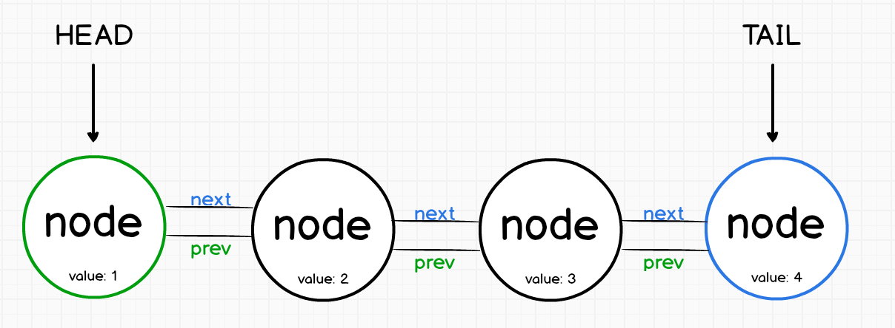
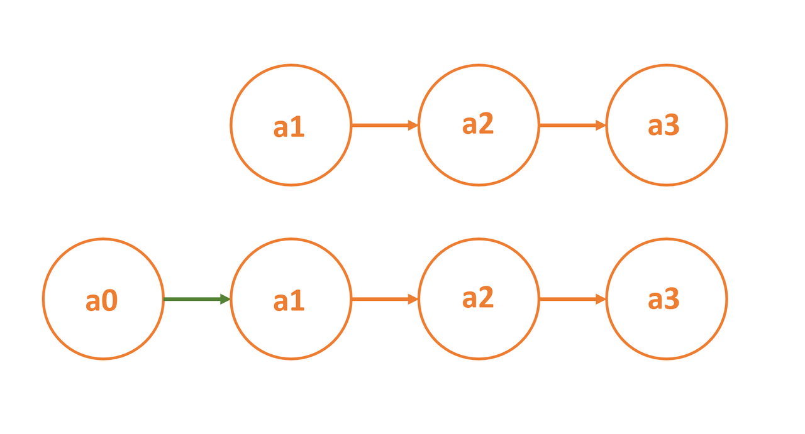
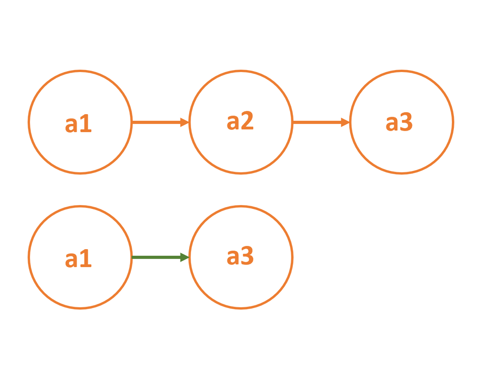
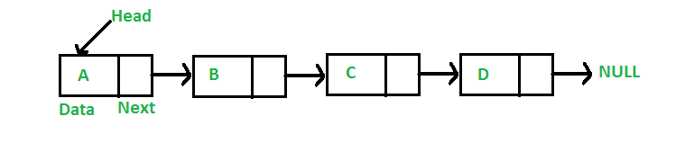

# Implementing a Linked List

A linked list exposes the ability to traverse the list from one node to another node.

The starting node is considered the head node from where the list can be traversed.

## The Head Node in Linked Lists

The first node in a linked list is called the head node.

If the linked list is empty, then the value of the head node is NULL.

## Adding a new head node in a linked list

When adding a new node to the start of a linked list, it is necessary to maintain the list by giving the new head node a link to the current head node.

For instance, to add a new node a0 to the begining of the linked list, a0 should point to a1.

## Removing a node from the middle of a linked list

When removing a node from the middle of a linked list, it is necessary to adjust the link on the previous node so that it points to the following node.

In the given illustration, the node a1 must point to the node a3 if the node a2 is removed from the linked list.

## Linked List data structure

A linked list is a linear data structure where elements are not stored at contiguous location.

Instead the elements are linked using pointers.

In a linked list data is stored in nodes and each node is linked to the next and, optionally, to the previous.

Each node in a list consists of the following parts:

- data
- A pointer (Or reference) to the next node
- Optionally, a pointer to the previous node
